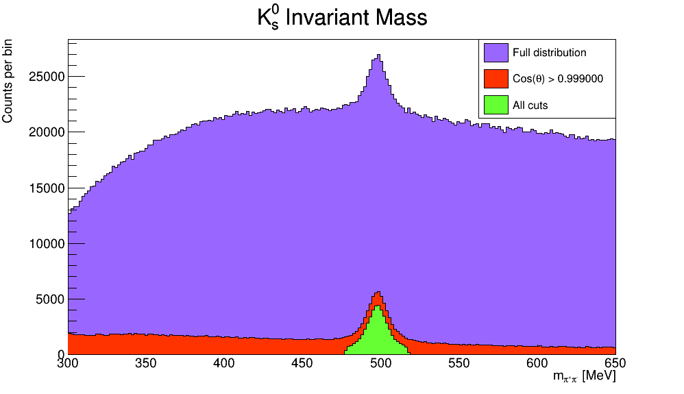

# Lab Book

## Coordinates and Momentum 
The momentum of a particle is the product of its mass and its velocity
$$ p = m\cdot v = (p_x, p_y, p_z)$$
In spherical coordinates centered at the collision point
$p =(|p|, \theta, \phi)$, where $\theta$ is the polar angle, and $\phi$
is the azimuthal angle. Since most detectors are cylindrical, however, 
a new magnitude known as **pseudorapidity** is used
$$\eta = -\ln\left(\tan\left(\frac{\theta}{2}\right)\right) $$
with $\eta \in (-\infty, \infty)$. In hardron collider physics, $\eta$ is 
preferred over $\theta$ because, loosely speaking, particle production 
is constant as a function of pseudorapidity.

Besides, tranvserse momentum ($p_T$), is also preferred and it is 
calculated from tranvseral energy, delivered upon the calorimeters.

So, in particle physics, linear momentum is presented by 
$$p = (p_T, \eta, \phi)$$
To obtain cartesian momenta $(p_x, p_y, p_z)$, with the $z$-axis 
corresponding to the axis of the beam, the following conversions are used:
 - $p_x = p_T\cos(\phi)$
 - $p_y = p_T\sin(\phi)$
 - $p_z = p_T\sinh(\eta)$

With the following results:
$$
\begin{aligned}
 |p| &= \sqrt{p_x^2 + p_y^2 + p_z^2} \\
     &= \sqrt{p_T^2\cos^2(\phi) + p_T^2\sin^2(\phi) + p_T^2\sinh^2(\eta)} \\
     &= p_T\sqrt{1 + \sinh^2(\eta)} \\
     &= p_T\cosh(\eta)
\end{aligned}
$$
by the identity $\cosh^2(x) - \sinh^2(x) = 1$. And of course we also have
$$p_T = \sqrt{p_x^2 + p_y^2}$$

## Determining lifetime of particles
The mean lifetime of a particle can be determined using
$$ d = ct\gamma\beta$$
where $\beta = v/c$ and $\gamma = 1/\sqrt{(1-\beta^2)}$, and $d$ is the distance
between the primary and secondary vertices. Using the relativistic
momentum $p = \gamma m v$, we can rearrange this to obtain:
$$ t = \frac{dm}{pc} $$
Thus we can determine the lifetime of a particle using nothing but the distance
between primary and secondary vertices, the mass of the particle (as given by
the PDG), and it's 3D momentum, which is easily accessible using: 
  - `SG::AuxElement::ConstAccessor<float> getPx( "px" );`
  - `SG::AuxElement::ConstAccessor<float> getPy( "py" );`
  - `SG::AuxElement::ConstAccessor<float> getPz( "pz" );`
  - and the primary and secondary vertices' `x()`, `y()` and `z()` methods to 
  determine $d$.

The first  four bullets show methods outlining the way to obtain information 
about secondary vertices within an AnalysisBase project. Certain tools 
such as `InDetV0Finder` have been used to process the ATLAS data and make 
such pieces of information easily accessible.

## Fitting Particle Lifetime Distribution
The lifetime distribution of particles can be fit using an exponential 
model of the form
$$f(t) = C_Ae^{t/\tau_A} + C_Be^{t/\tau_B} + C_0$$
Where $C_A$ and $\tau_A$ model particle A's lifetime, and $C_0$, $C_A$ and 
$\tau_B$ models the background lifetime.

## $K^0_s$ and $\Lambda^0$ Invariant Mass Plots
Each secondary vertex is assigned a kaon and lambda mass. These
two quantities can be plotted to obtain invariant mass distributions
which contain a distinct signal (seen as a spike) and a background. 
To isolate this signal, certain cuts can be performed to properly 
identify the kaons and lambdas.

<!--TODO: Use correct image -->

